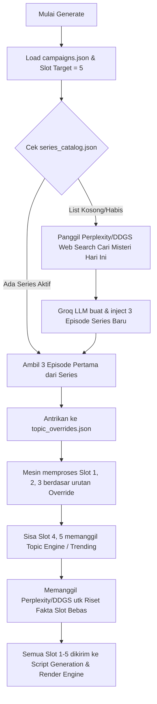

# 🚀 Dokumentasi Rilis: Autonomous Series Engine & Global Web Research
**Tanggal Rilis:** April 2026  
**Status:** Stabil & Siap Produksi (Production Ready)  
**Komponen Utama:** CLI, Series Engine, Script Engine, Research Engine

---

## 1. 🎯 Ringkasan Eksekutif (*Executive Summary*)
Pembaruan ini berfokus pada dua tujuan krusial dalam pengembangan *Mesin Cuan*:
1. **Otomatisasi Penuh (Zero-Touch Generation):** Mencapai status di mana mesin dapat merilis naskah hingga berbulan-bulan ke depan tanpa perlu campur tangan manual untuk pembuatan antrean *series* maupun pemilihan jadwal harian.
2. **Zero-Hallucination & Factual Accuracy:** Memastikan seluruh naskah tulisan AI—baik topik berseri maupun bebas—berakar 100% pada penelusuran web nyata (fakta internet), untuk meminimalisasi halusinasi AI jadul yang asal menebak fakta.

---

## 2. 🏗️ Arsitektur & Perubahan Modul Utama

Pembaruan ini merombak empat *engine* inti. Berikut adalah teknis perubahan yang terjadi di belakang layar:

### A. Terminal Control Interface (`strategi_cli.py` & `strategi.bat`)
Antarmuka pengguna (CLI) telah diperbarui untuk menghapus ketergantungan pada modifikasi *file* `json` manual oleh operator.
- **Modul Jadwal Baru (`[11] Atur Tanggal Campaign`)**: Menginjeksi *start_date* dan *end_date* langsung ke object `campaigns.json` via input CLI (format `YYYY-MM-DD`). Engine akan mendeteksi `campaigns` mana yang berstatus `active=true` dan otomatis menuliskan rentang baru.
- **One-Click Batch Render (`[13] MULAI GENERATE VIDEO`)**: Menjalankan *instance bash* `os.system("python main.py")`. Modul ini meng-eksekusi mesin secara asinkronus ke antrean GDrive, membaca parameter kampanye *batch* yang telah diset sebelumnya.

### B. Autonomous Series Engine (`engine/series_engine.py`)
Ini adalah jantung dari *update* kali ini.
- **Logika `_queue_next_series_episodes` Diperbarui**: Fungsi ini kini menyedot hingga **3 sisa episode sekaligus** dari memori `series_catalog.json` aktif. Karena default harian dirender 5 *slots*, 3 *slots* pertama selalu diprioritaskan untuk diokupasi oleh *series* (memenuhi rasio 3:2 secara elegan).
- **Logika `_auto_invent_new_series` Ditambahkan**:
  - **Kondisi Memicu**: Berjalan otomatis jika iterasi *loop* mendeteksi semua seri aktif memiliki `remaining_items == 0`.
  - **Mekanik Web-Research**: Mesin langsung memanggil *Perplexity/Ollama* dengan parameter `query="Berita horor, kejadian misteri nyata, atau thread konspirasi terbaru yang sedang viral"`.
  - **Injeksi LLM (Groq)**: Menggunakan model *Llama-3.3-70b/8b*, prompt diatur super-ketat dengan format paksaan *JSON Output*. Menghasilkan `[Part 1, Part 2, Part 3]` yang linear.
  - **Aksi Final**: Menulis objek JSON baru ini ke dalam `series_catalog.json`, dan me-*restart* alur *queuing* secara *recursive*.

### C. Global Research Enforcement (`engine/script_engine.py`)
Sebelumnya fungsi penarikan Google Search (`research_engine`) hanya dipicu manakala nilai *topic_source* bertuliskan `manual_override`.
- **Patch Diterapkan**: Kondisional pembatas dibuang. Skrip sekarang akan **selalu** memanggil fungsi `research_topic()` pada setiap proses pembuatan *System Prompt*.
- **Integrasi "Topik Bebas"**: Topik bebas AI yang diambil murni dari algoritma YouTube Trending kini di-*double check* dengan mencari referensi berita aslinya via Search, sehingga memperkaya `context_addon` pada Prompt.

### D. Skema *Fallback* Agen Search `DuckDuckGo` (`engine/research_engine.py`)
*Perplexity* tetap dipakai sebagai Tier 1, tetapi apabila kunci API meledak/rate-limit terlampaui, agen Tier 2 (Ollama Lokal) kini jauh lebih bertenaga.
- **Tool Calling Enabled**: Jika Fallback diaktifkan, modul akan melemparkan schema `tools` ke Ollama lokal (`web_search`).
- **Data Fetching via DDGS**: Jika Ollama merespon dengan `"name": "web_search"`, *Python* kita via modul abstrak `duckduckgo-search` diam-diam akan mengekskusi pencarian riil di *background*, membungkus 3 URL/cuplikan situs teratas, dan menyetorkannya kembali ke iterasi *chat API* agar Ollama bisa membaca teks tersebut.

---

## 3. 🔄 Flowchart Generasi Harian (Workflow Baru)

Untuk memastikan penggunanya *hands-off*, ini adalah apa yang dilalui Mesin sejak Anda memencet menu `[13]`:



---

## 4. 🛠️ Struktur Data Penting (Interface Guideline)

Bagi *developer* masa depan yang ingin menyuntik seri ke dalam mesin secara manual, perhatikan skema penulisan ini:

**Format `series_data` yang diterima oleh Engine:**
```json
{
  "id": "misteri_contoh_slug_tanpa_spasi",
  "name": "Misteri Tergelap Kota Tua",
  "description": "Deskripsi singkat mengenai misteri kota tua di pedalaman jawa",
  "items": [
     "Kasus Hilangnya Kereta Malam 1990",
     "Saksi Mata & Investigasi Stasiun",
     "Konspirasi Pemda dan Kesimpulan"
  ],
  "active": true,
  "viral_threshold_for_part2": 1000
}
```

---

## 5. 💡 Panduan Troubleshooting Cepat

1. **AI Hanya Memproduksi "Topik Bebas" secara keseluruhan?**
   *Cek:* Buka `logs/pipeline.log`. Pastikan kunci API `GROQ_API_KEY` valid, karena kalau Groq gagal men-generate *JSON*, mesin *auto-invent series* tidak akan berfungsi dan langsung digeser ke pencarian manual.
2. **Riset Lokal DuckDuckGo Gagal/Timeout?**
   *Cek:* Library `duckduckgo-search` kadang memblokir terlalu banyak panggilan proxy. Anda bisa mereset IP lokal router Anda atau menunggu 10 menit agar IP blokir *DuckDuckGo* terbuka lagi.
3. **Format Tanggal Invalid?**
   Mesin hanya akan membaca format ketat `YYYY-MM-DD` lewat CLI. Jika salah tulis, buka `config/campaigns.json` via VSCode dan pulihkan secara manual.
